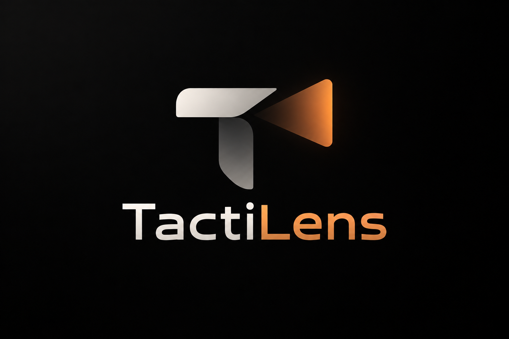

<p align="center">
  
</p>

<h1 align="center">See the pattern. Prepare the team.</h1>

<p align="center">
  Opposition intelligence for the coaching room.<br />
  Powered by TactiVision AI. Designed for Amazon Fire TV.
</p>

<p align="center">
  <a href="#status"></a>
  <a href="#hackathon"></a>
  <a href="./docs/tactilens/ARCHITECTURE.md"></a>
</p>

<p align="center">
  <a href="#why-tactilens">Why TactiLens</a> ·
  <a href="#status">Status</a> ·
  <a href="#quick-start">Quick start</a> ·
  <a href="./docs/tactilens/ARCHITECTURE.md">Architecture</a> ·
  <a href="./docs/tactilens/IMPLEMENTATION_PLAN.md">Roadmap</a>
</p>

---

## Why TactiLens

A coaching room needs a clear answer to three questions: **What does the opponent
do? Where is the evidence? What should we prepare for?**

TactiLens is being designed to put those answers on the television: concise
opposition briefings, tactical context and the match clips behind each finding,
navigated with a remote.

It builds on the existing TactiVision Opposition Analyst. The intelligence and data
stay shared; the interaction model is designed for the room.

| Understand the opponent | Inspect the evidence | Brief the team |
| --- | --- | --- |
| Start with strengths, weaknesses and tactical context. | Move from a finding to its supporting match occurrences. | Present a focused sequence without a laptop-driven workflow. |

*Evidence playback and the television experience are planned capabilities.*

## Status

**Foundation / architecture.** The existing web analyst is implemented in this
repository. The TactiLens TV client, computer-vision pipeline and AWS integration
are **not started**.

| In the existing codebase | Planned for TactiLens |
| --- | --- |
| Club and international opponent selection | Fire TV / Vega delivery surface |
| Streaming Opposition Analyst and document citations | Validated findings with clip-level provenance |
| Tactical dashboard, pitch maps and charts | Remote navigation and ten-foot layouts |
| Knowledge ingestion and full-text retrieval | Offline computer vision and evidence validation |
| Opposition and FIFA-style PDF exports | Briefing mode and evidence playback |

The current pitch heatmaps and radar scores use text heuristics. They are not
measured tracking data. Existing report cards contain narrative analysis, not
verified video findings. The [foundation audit](./docs/tactilens/FOUNDATION_AUDIT.md)
documents these boundaries and identifies what can be reused.

## One foundation. Two experiences.

```text
                         TactiVision AI
                 Shared intelligence and data
                            /      \
                           /        \
               Opposition Analyst   TactiLens
               Web analysis         Fire TV briefings
               Knowledge management Remote navigation
               PDF reports          Evidence playback
               [existing]           [planned]
```

The proposed evidence pipeline keeps observations, tactical reasoning and
explanation separate:

**Video → offline CV → structured events → validated evidence → briefing → TV**

A finding must be traceable to its source. Insufficient evidence should produce
an abstention. Language models may explain verified evidence; they must not invent
timestamps, occurrence counts or confidence.

See the [architecture](./docs/tactilens/ARCHITECTURE.md) for system boundaries,
contracts and platform decisions.

## Quick start

Run the **existing web application** locally. TV setup will be documented once the
target client exists.

Prerequisites: Node.js 22+ and npm. Connected analysis and knowledge features also
require a configured Supabase backend and server-side provider credentials.

```bash
git clone https://github.com/ousssamarahmani/TactiLens.git
cd TactiLens
npm ci
```

Create your local configuration:

```powershell
# Windows PowerShell
Copy-Item .env.example .env.local
```

```bash
# macOS / Linux
cp .env.example .env.local
```

Set `VITE_SUPABASE_URL` and `VITE_SUPABASE_PUBLISHABLE_KEY` in `.env.local` to your
project URL and public key, then start the app:

```bash
npm run dev
```

Open [localhost:8080](http://localhost:8080). The two browser variables alone do not
deploy the backend. Existing migrations and Edge Functions live in
[`supabase/`](./supabase); the analyst uses server-side `LOVABLE_API_KEY`,
`SUPABASE_URL` and `SUPABASE_SERVICE_ROLE_KEY`. Some ingestion functions require
additional provider configuration. Never put server secrets in `VITE_*` variables.
A clean backend setup still needs verification.

## Development

[Task backlog](./docs/tactilens/TASKS.md) · [Validation plan](./docs/tactilens/VALIDATION_PLAN.md)

```bash
npm run test
npm run build
npm run lint
```

The prior foundation validation passed the production build and one placeholder
unit test. Lint has 25 existing errors and 7 warnings. These checks do not establish
backend or TV readiness. See the [validation plan](./docs/tactilens/IMPLEMENTATION_PLAN.md).

| Path | Responsibility |
| --- | --- |
| [`src/pages/`](./src/pages) | Analyst and knowledge-base experiences |
| [`src/components/`](./src/components) | Dashboard, tactical visuals and UI |
| [`src/data/`](./src/data) | Existing football datasets |
| [`src/hooks/`](./src/hooks) · [`src/lib/`](./src/lib) | Analyst workflow, retrieval and reports |
| [`supabase/`](./supabase) | Backend functions and database migrations |
| [`docs/tactilens/`](./docs/tactilens) | Audit, architecture, plan and change record |

## Hackathon

Prepared for [**Build, Ship, Shape: Amazon Developer Hackathon 2026**](https://amazonappdev2026.devpost.com/).

| | Project direction |
| --- | --- |
| Primary track | Fire TV |
| Target | Fire OS or Vega OS; platform validation pending |
| AWS Builder | Planned; integration evidence pending |
| Deadline | October 23, 2026, 12:00 PM Pacific Time |

Submission preparation must include a working device/simulator demo, a public
video under three minutes, reproducible setup, product feedback and an accurate
record of changes made during the event. The existing TactiVision application is
the baseline, not new hackathon work.

[Official rules](https://amazonappdev2026.devpost.com/rules) ·
[Developer resources](https://amazonappdev2026.devpost.com/resources) ·
[Contribution record](./docs/tactilens/HACKATHON_CHANGES.md)

## Build with us

Start with the [foundation audit](./docs/tactilens/FOUNDATION_AUDIT.md) and
[implementation plan](./docs/tactilens/IMPLEMENTATION_PLAN.md). Propose focused
changes through [issues](https://github.com/ousssamarahmani/TactiLens/issues)
and read the [contribution guide](./CONTRIBUTING.md) before opening a pull request.

The next proposed milestone is to characterize the existing analyst behavior,
then extract reusable contracts without breaking the web experience.

## License and assets

An open-source license has not yet been selected. A license decision is required
before using the public repository for hackathon submission. Football datasets,
reports and footage need their own provenance and usage-rights review.

The supplied TactiLens artwork lives in [docs/assets](./docs/assets).
Platform names identify intended integrations, not sponsorship or endorsement.

---

<p align="center"><strong>TactiLens</strong><br />Reuse the intelligence. Design for the room.</p>
