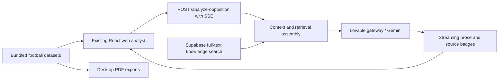
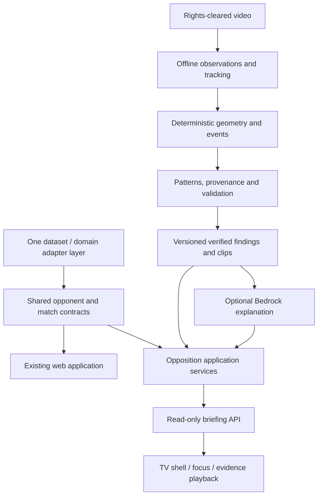

# Reusable Opposition Analyst architecture

Status: PROPOSED, 2026-09-22. Implementation NOT STARTED. Source findings are in the [audit](FOUNDATION_AUDIT.md).

## Current system

`useOppositionAnalyst` binds component state, dataset selection and streaming callbacks. The Edge Function combines retrieval, prompt construction, provider calls and SSE framing. There is reusable knowledge and domain behavior, but no independent verified-finding service yet.

## Target responsibilities

The web application keeps its routes, ingestion workflow, streaming endpoint and report exports. TV is a new delivery surface in the same repository, consuming the same domain contracts. It must not copy the web app or its datasets. Shared modules must not import browser globals, React, Deno globals or AWS clients; each surface supplies adapters.

### Minimal future layout

| Proposed path | Purpose and constraint |
| --- | --- |
| `src/domain/opposition/` | Pure TypeScript contracts, identity mappings and adapters for existing web consumption; no new build system initially |
| `supabase/functions/_shared/opposition/` | Server context/retrieval helpers extracted incrementally behind the existing endpoint |
| `contracts/opposition/` | Language-independent versioned JSON Schema and explicitly synthetic test fixtures |
| `src/tactilens/` | Candidate web TV surface only if the platform spike proves packaging/playback/input support |
| `apps/tactilens/` | Alternative native TV target only if required by the chosen platform; do not create both implementations |
| `services/video-analysis/` | Future isolated CV worker and optional heavy dependencies |

These directories are proposals, not a restructuring performed by this foundation. A native client may justify a shared package later; avoid a monorepo migration until it is necessary.

## Contract design

All new boundary payloads carry `schemaVersion`; unknown measurements use `null` with a reason, never fabricated zero. Preserve legacy ID aliases and source references; migration mappings must be stable and reproducible.

| Contract | Required conceptual fields |
| --- | --- |
| Opponent | Stable ID, legacy aliases, name, club/national kind, source references |
| Match | Stable ID, competition/date, explicit home/away opponent IDs, nullable metrics, source and metric perspective |
| VideoAsset | ID, match ID, source checksum, rights/access record, duration, presentation timebase and normalized-video mapping |
| Observation/Track | Video ID, presentation timestamp, frame reference, track ID, class, bounding box, quality and model/version |
| PitchCalibration | Video interval, transform, coordinate convention, reprojection error and validity |
| TacticalEvent | ID, match/video interval, participants, derived geometry, algorithm/version and observation references |
| PatternOccurrence | ID, pattern version, event IDs, interval, included/excluded reason and clip ID |
| EvidenceClip | ID, video ID, source bounds, media reference/checksum, access policy and validation state |
| TacticalFinding | ID, opponent, statement, candidate/verified/abstained state, occurrence IDs, validation version, quality signals and reason codes |
| OppositionBriefing | ID/version, opponent, ordered sections/finding IDs, generated time, source revision, freshness and availability |

Prefer normalized pitch coordinates in `[0,1]` for the future interchange format, with a fixed documented origin, axes, and per-period attacking direction. Keep metric pitch dimensions for distance computations and transform only at rendering boundaries. This is a proposed convention requiring a known-position fixture, not the current heatmap convention.

Use source presentation timestamps for variable-frame-rate video; frame number divided by nominal FPS is insufficient. Clip ranges are start-inclusive/end-exclusive and map back to original media. Camera cuts/replays invalidate or segment tracking/calibration; unknown possession remains unknown.

### Verification boundary

Provenance chain: finding → occurrences → events → tracks/detections → frames → original video checksum. A document citation remains documentary support, not proof that a clip contains an event. Legacy prose cannot be relabeled VERIFIED by an LLM.

Validation requires accessible source clips, consistent timing and entity references, applicable calibration quality, unique occurrences and recorded validation decisions. Thresholds must be calibrated on held-out footage with coach review before promotion. Store measurable detection/tracking/calibration quality, evidence coverage and cross-match consistency; do not invent a combined confidence formula. Abstain for insufficient occurrences, occlusion, invalid calibration, unavailable media or conflicting observations. Invalidated evidence invalidates dependent findings.

### Opposition API and compatibility

Preserve existing `POST /functions/v1/analyze-opposition` request and SSE response framing. Add a separate versioned read contract for opponents, persisted briefings, findings and clip access after approval. TV does not send complete bundled datasets with every request. Validate payloads server-side; restrict data/media by authorized team and keep service credentials off clients. Provider-specific failures are translated by adapters, not embedded in domain types.

## Television interaction

Proposed flow: opponent selection → overview → finding detail → evidence playback, plus an ordered briefing mode. Every screen specifies default focus, four directional neighbors, SELECT action, BACK destination and restoration target. Playback returns to the originating finding; BACK at the root follows platform exit behavior. Loading, unavailable evidence, expired media access, empty and stale briefings retain a usable focus target. No primary action depends on hovering or text entry.

Reuse DOM pitch/chart components only on a compatible web target. For a native runtime reuse data transformations and visual design, and implement native renderers. A web-based spike is the first candidate because the source is React/Vite; choose the actual Fire OS/Vega target only after packaging, remote controls, seek behavior and on-device readability are demonstrated. Current browser execution is not TV compatibility evidence.

## CV and AWS boundaries

Offline CV pipeline: ingest/decode → detect players/ball → track → classify teams → calibrate pitch → project coordinates → derive possession/events → find patterns → cut clips → validate. Model/tracker/runtime selection awaits licensed-footage benchmarks; keep heavy dependencies outside the frontend. Prefer precomputed briefings for the demonstration.

Proposed AWS responsibilities: S3 for protected originals/normalized media/clips/artifacts; an authenticated read API for persisted briefings; optional Bedrock for evidence-constrained explanation. Retain Supabase as the existing knowledge store unless an ADR justifies migration. DynamoDB and AgentCore are not required by this design. Evaluate local GPU or a batch/container worker for CV; do not place heavy video processing in a short-lived request handler. Budgets, region, service selection and deployment remain undecided. No infrastructure is provisioned.

## Decisions to record before implementation

Planning update: the intended AWS Builder path is Bedrock reasoning plus AgentCore Runtime hosting for a scoped opposition orchestrator. Retrieval tools return evidence-owned values; a deterministic gate controls VERIFIED status; game-plan synthesis produces recommendations and a briefing director prioritizes validated findings. Begin with one orchestrator, evaluating specialist agents only after measuring benefit. Direct clip retrieval must not require generation. This is planned work, NOT STARTED; see [tasks](TASKS.md) and [validation](VALIDATION_PLAN.md). Earlier optional-AWS language describes the reusable platform boundary, not a completed integration.

TV target/framework and player; stable identity/missing-value migration; schema versioning; coordinate orientation; rights-cleared evaluation footage; CV runtime/models/compute; quality/abstention thresholds; media authorization; persistence ownership; Bedrock/provider boundary. Each decision needs alternatives, measured evidence where applicable, compatibility impact and rollback strategy.
